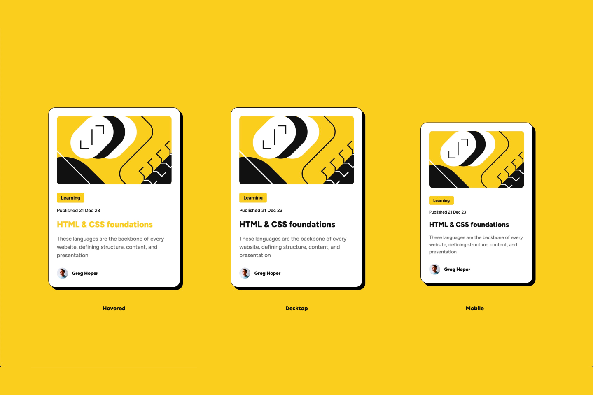

# Frontend Mentor - Blog preview card solution

This is a solution to the [Blog preview card challenge on Frontend Mentor](https://www.frontendmentor.io/challenges/blog-preview-card-ckPaj01IcS). Frontend Mentor challenges help you improve your coding skills by building realistic projects. 

## Table of contents

- [Overview](#overview)
  - [The challenge](#the-challenge)
  - [Screenshot](#screenshot)
  - [Links](#links)
- [My process](#my-process)
  - [Built with](#built-with)
  - [What I learned](#what-i-learned)
- [Author](#author)

**Note: Delete this note and update the table of contents based on what sections you keep.**

## Overview

### The challenge

Users should be able to:

- See hover and focus states for all interactive elements on the page

### Screenshot



### Links

- Solution URL: [This Github](https://github.com/nashrulmalik/fm02-blog-preview-card)
- Live Site URL: [Live Site](https://nashrulmalik.github.io/fm02-blog-preview-card/)

## My process

### Built with

- Semantic HTML5 markup
- CSS custom properties
- Flexbox

### What I learned

Don't forget to add hover and media functionality.

```css
h1:hover {
    color: #F4D04E;
}
```

```css
@media screen and (max-width: 375px) {
    h5, h6 {
        font-size: 12px;
    }

    h1 {
        font-size: 20px;
    }

    p {
        font-size: 14px;
    }

    main {
        width: 277px;
    }
    
}
```

## Author

- Website - [Add your name here](https://nashrulmalik.com)
- Frontend Mentor - [@yourusername](https://www.frontendmentor.io/profile/nashrulmalik)
- Twitter - [@yourusername](https://www.twitter.com/nashrulmalik)